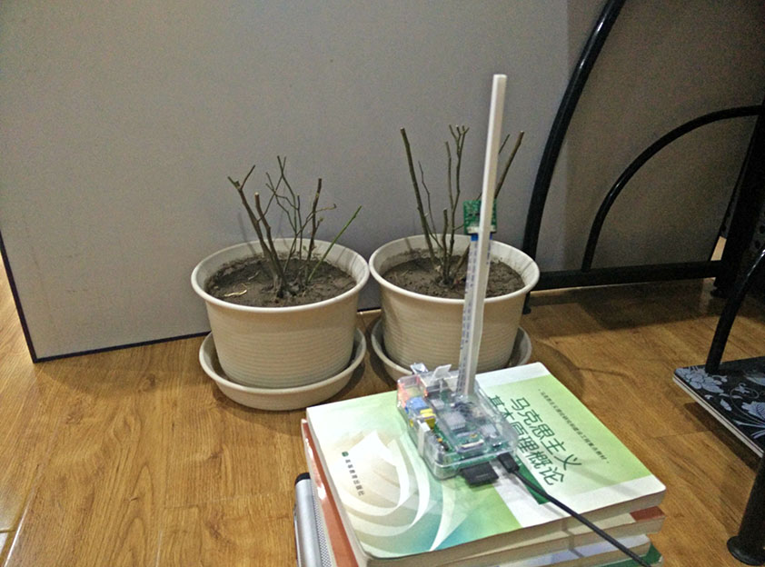
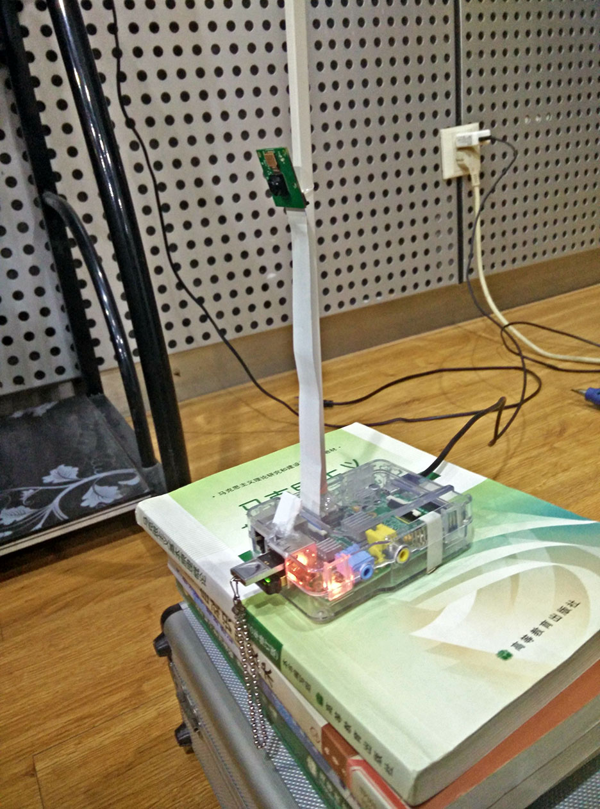
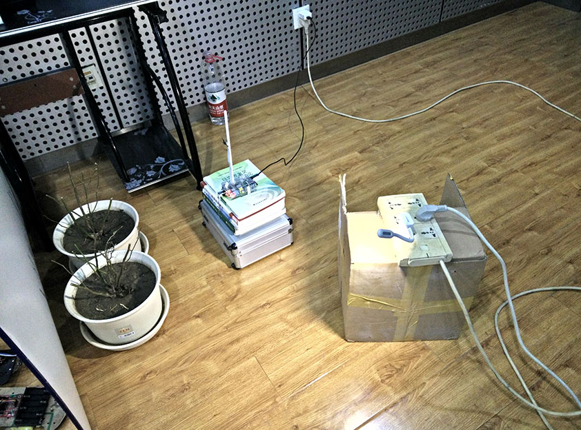

# 树莓派程序

----

# 树莓派定时拍照

[paizhao.c](paizhao.c)

定时拍照存入U盘,与此同时通过数码管显示拍照文件夹大小和剩余时间.

[shouhu.c](shouhu.c)

守护进程,在拍照进程结束后打开拍照进程,此程序放入开机启动项中.

## 装置图

##视频

####[两盆花的一天](http://v.youku.com/v_show/id_XOTE2NDMwMjk2.html)

####[花盆里的蜗牛](http://v.youku.com/v_show/id_XOTIwNzU4MjEy.html)

####[两盆花的这几天](http://v.youku.com/v_show/id_XOTIyMTE5OTky.html)
